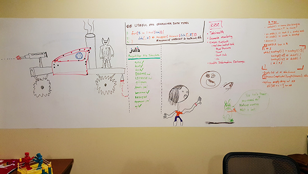

<!-- README.md is generated from README.Rmd. Please edit that file -->

```{r setup, include = F}
knitr::opts_chunk$set(
      echo     = TRUE
    , eval     = FALSE
    , collapse = TRUE
    , comment  = '#>'
    )
```


# Paul's Personal Package Panacea 

[](https://github.com/Paul-James/pjames/releases)
[](https://tidyverse.org/lifecycle/#experimental)
[](https://travis-ci.org/Paul-James/pjames)
[](https://ci.appveyor.com/project/Paul-James/pjames)
[](https://codecov.io/github/Paul-James/pjames?branch=master)


## Code of Conduct

Please note that this project is released with a `Contributor Code of Conduct`. By participating in this project you agree to abide by its terms.

## How to install the package

The `remotes` `R` package is helpful in order to easily install any packages from `GitHub`. Run the following code in an `R` console:

```r
if (!'remotes' %in% rownames(installed.packages())) {

  install.packages('remotes')

}

remotes::install_github('paul-james/pjames')
```

## Introduction

This `R` package repo is a collection of functions put together for use by me and my friends. This is meant to help keep your `.Rprofile` and the global environment clear. For example, the `rm(list = ls())` command clears out any custom functions defined in the `.Rprofile` because those functions are part of the global environment. This also saves time and effort pasting/sourcing commonly used functions to the top of every `R` script you write. All these manual steps can be avoided with the use of a package.

## Caveat to using this package

Using the functions within this package, though helpful for everyday coding, may pose a repoducibility issue. If you were to share your sweet script with someone and you used one of the functions defined in this package, your friend will get errors, `Error: could not find function "mylib"`, if they don't also have access to the package on their computer/server.

A few methods for reproducibility:

1. Instruct the person you share code with to install the package. This is just like they would have to do if you used `plotly` or `dplyr`.
1. Replace any functions you used from this package with more common or `Base R` equivalents.
1. Define the function at the top of the script so it will travel wherever the code goes.
1. Include another script with all user defined functions seperate from the script and `source()` in that script of functions.
    * This method isn't super great for sharing code, but it's the preferred method for large projects or complicated analysis that have many user defined functions whether you're sharing your code or not.

The problem with adopting the last two methods listed is if you're using the same user defined functions across many/all projects, then you're copying and pasting them into every single project. 


---


