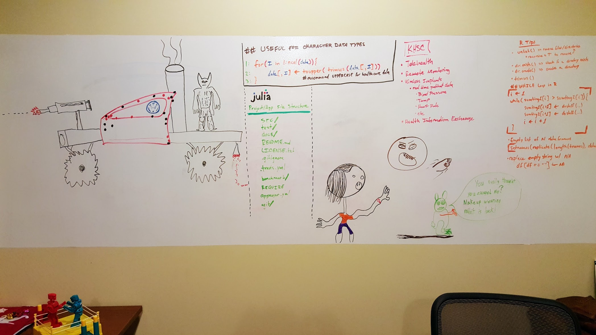

Paul's Personal Package Panacea
================

-   [Code of Conduct](#code-of-conduct)
-   [Introduction](#introduction)
    -   [Caveat to using this package](#caveat-to-using-this-package)
-   [How to install the package](#how-to-install-the-package)
-   [How to update the package](#how-to-update-the-package)
    -   [Example](#example)

<!-- README.md is generated from README.Rmd. Please edit that file -->
<!-- [](https://travis-ci.org/hrbrmstr/sergeant)  -->
<!-- [](https://codecov.io/gh/hrbrmstr/sergeant) -->
<!-- [](https://cran.r-project.org/package=pjames) not on cran, but useful example -->
Code of Conduct
===============

Please note that this project is released with a `Contributor Code of Conduct`. By participating in this project you agree to abide by its terms.

Introduction
============

This `R` package repo is a collection of functions put together for use by me and my friends. Everyone can add to this package as long as the functions are robust and have been well written and documented. This is meant to help keep `.Rprofile`s and the global environment clear. For example, the `rm(list = ls())` command clears out any custom functions defined in the `.Rprofile` because those functions are part of the global environment. This also saves time and effort pasting/sourcing commonly used functions to the top of every `R` script you write. All these manual steps can be avoided with the use of a package.

Caveat to using this package
----------------------------

Using the functions within this package, though helpful for everyday coding, pose a repoducibility issue. If you were to share your sweet script with someone and you used one of the functions defined in this package, your friend will get errors: `Error: could not find function "myLibrary"`.

A few methods for reproducibility:

1.  Replace any functions you used from this package with more common or `Base R` equivalents.
2.  Define the function at the top of the script so it will travel wherever the code goes.
3.  Include another script with all user defined functions seperate from the script and `source()` in that script of functions.
    -   This method isn't super great for sharing code, but it's the preferred method for large projects or complicated analysis that have many user defined functions whether you're sharing your code or not.

How to install the package
==========================

Ask me for a `PAT` (personal access token). Then save the token in `~/.Renviron` like so:

``` r
cat(
      'GITHUB_PAT=[replace-me-(brackets-as-well)-with-PAT]\n'
    , file   = file.path(
          normalizePath('~/')
        , '.Renviron'
        )
    , append = T
)
```

Replace **\[replace-me-(brackets-as-well)-with-PAT\]** with the token I give you and restart the R session (which reloads the R environment variables). Now, in an R console, run: `devtools::install_github('paul-james/pjames')`.

How to update the package
=========================

To make changes you need to **clone** the repo via `git`, not just **install** it via `R`. After cloning, make your own function files or change existing ones. It's easiest to make a copy of an existing function's `R` script file to use as a template for any new functions you create.

After you make changes to a function or add your own you need to remake the documentation, commit and push changes to Github, then reinstall the package. It's really easy to do.

1.  load the `devtools` and `roxygen2` `R` packages
2.  in `R`, change the working directory to the root directory of the package repo
3.  create the documentation using `document()` from the `devtools` package
4.  use `git` to `commit` and `push` function and documentation changes as well as `git add` to add new functions to the repo
5.  use the `devtools::install_github()` command to reinstall the package
6.  if using Rstudio, refresh packages/documentation

Example
-------

``` r
## 1. LOAD THE LIBS -----------------------------------
library(devtools);library(roxygen2)

## 2. CD TO PACKAGE REPO ROOT -------------------------
setwd('~/repos/github/pjames')

## 3. REMAKE THE DOCUMENTATION ------------------------
document()
```

``` bash
## 4. USE GIT TO COMMIT/PUSH CHANGES ------------------
cd ~/repos/github/pjames
git commit -m "fix typos in functions" R/tocamel.R man/tocamel.Rd
git push origin master
```

``` r
## 5. REINSTALL THE PACKAGE ---------------------------
# Make sure the PAT is already saved in the GITHUB_PAT env var
stopifnot(Sys.getenv('GITHUB_PAT') != '')
install_github('Paul-James/pjames')

## 6. REFRESH PACKAGES/DOCUMENTATION ------------------
message('click the "Refresh" button in the "Packages" tab of the "Files, Plots, Packages, Help, Viewer" pane')
```

------------------------------------------------------------------------


